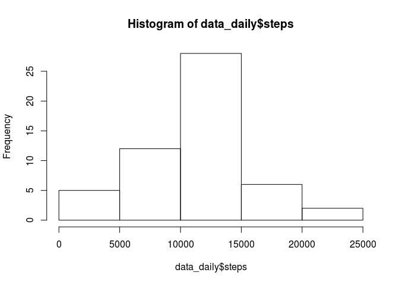
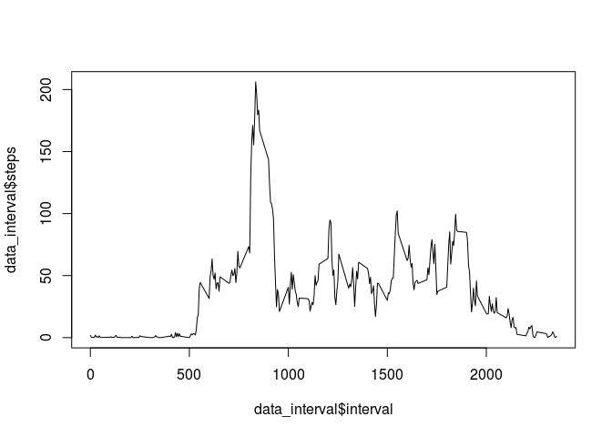
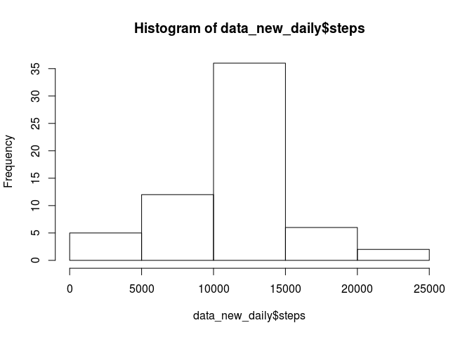
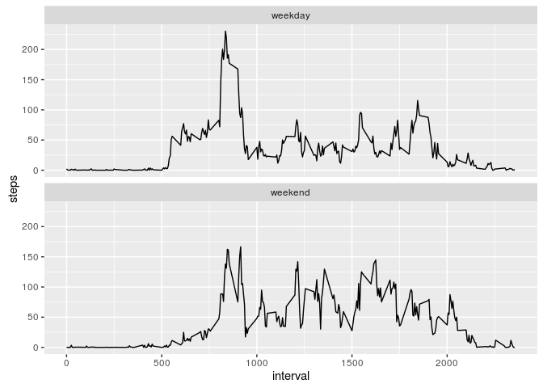

# Reproducible Research: Peer Assessment 1


## Loading and preprocessing the data

```r
setwd("/home/lukechen/git/RepData_PeerAssessment1")
data<-read.csv("activity.csv")
data<-data.frame(data)
```

## What is mean total number of steps taken per day?
1. The total number of steps taken per day can be calculated by

```r
data_daily<-aggregate(steps~date,data,FUN="sum")
```
2. A histogram of total number of steps taken per day

```r
hist(data_daily$steps)
```

<!-- -->


3. Mean and Median of total number of steps taken per day is

```r
mean(data_daily$steps,na.rm = TRUE)
```

```
## [1] 10766.19
```

```r
median(data_daily$steps, na.rm=TRUE)
```

```
## [1] 10765
```

## What is the average daily activity pattern?

```r
data_interval<-aggregate(steps~interval,data,FUN="mean",na.action = na.omit)
plot(data_interval$interval,data_interval$steps,type='l')
```

<!-- -->


2. Interval that contains max average steps is

```r
max<-which.max(data_interval$steps)
data_interval[max,1]
```

```
## [1] 835
```

## Imputing missing values
1. Total number of rows with NAs

```r
sum(is.na(data$steps))
```

```
## [1] 2304
```

3. Replace NAs with average of interval

```r
library(plyr)
data_new<-ddply(data, 
      .(interval), 
      transform, 
      steps=ifelse(is.na(steps), mean(steps, na.rm=TRUE), steps))
```

4. A histogram of total number of steps taken per day

```r
data_new_daily<-aggregate(steps~date,data_new,FUN="sum")
hist(data_new_daily$steps)
```

<!-- -->


Mean and Median of total number of steps taken per day is

```r
mean(data_new_daily$steps)
```

```
## [1] 10766.19
```

```r
median(data_new_daily$steps)
```

```
## [1] 10766.19
```


Values are different from first part of the assignment. Imputing missing data seems to increase the median of total daily number of steps and increased the frequency of days that hit the median total daily number of steps.

## Are there differences in activity patterns between weekdays and weekends?

```r
data_new$date<-as.Date(data_new$date)
data_new$dayofweek<-weekdays(data_new$date)
data_new$typeofday <- rep(NA, nrow(data_new))
data_new[data_new$dayofweek %in% c('Saturday','Sunday'), ][, "typeofday"] <- "weekend"
data_new[!(data_new$dayofweek %in% c('Saturday','Sunday')), ][, "typeofday"] <- "weekday"
data_new_interval<-aggregate(steps~interval+typeofday,data_new,FUN="mean")
data_new_interval$typeofday<-as.factor(data_new_interval$typeofday)

library(ggplot2)
qplot(interval,steps,data=data_new_interval,geom=c("line"))+facet_wrap(~ typeofday, ncol = 1)
```

<!-- -->
